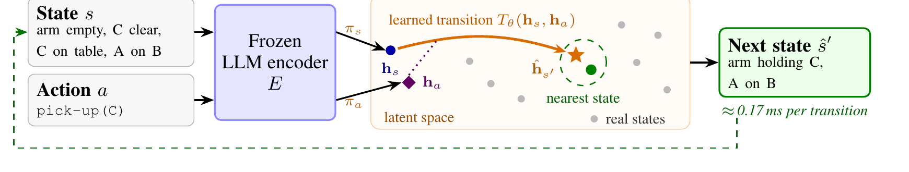
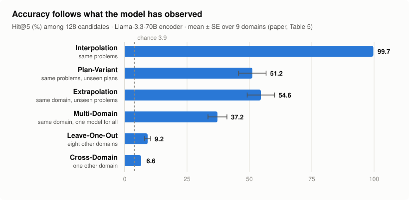

<div align="center">

# Textual Planning with Explicit Latent Transitions

**EmbedPlan: a fast transition model for planning, learned on top of frozen LLM text embeddings**

Eliezer Shlomi<sup>1\*</sup>, Ido Levy<sup>2\*</sup>, Eilam Shapira<sup>1</sup>, Michael Katz<sup>2</sup>, Guy Uziel<sup>2</sup>,
Segev Shlomov<sup>2</sup>, Nir Mashkif<sup>2</sup>, Roi Reichart<sup>1</sup>, Sarah Keren<sup>1</sup>

<sup>1</sup>Technion – Israel Institute of Technology &nbsp; <sup>2</sup>IBM &nbsp; <sup>\*</sup>Equal contribution

[](https://embedplan.github.io)
[](https://arxiv.org/abs/2602.04557)
[](https://doi.org/10.5281/zenodo.23056147)
[](https://github.com/embedplan/EmbedPlan/actions/workflows/tests.yml)
[](LICENSE)
[](pyproject.toml)
[](https://colab.research.google.com/github/embedplan/EmbedPlan/blob/main/examples/quickstart.ipynb)

</div>

<p align="center">
  
</p>

Planning needs a **transition model**: given a state and an action, what is the next state?
When a large language model plays that role, every next state is generated token by token,
which makes searching over many possible futures slow and expensive. **EmbedPlan** replaces
generation with retrieval. It embeds natural-language descriptions of the state and the action
with a **frozen** LLM, predicts the embedding of the next state with a lightweight learned
network, and returns the closest real state. Because the network trains on top of any
encoder, EmbedPlan is also a controlled way to compare text representations for learning
transitions.

This repository holds a library you can use on your own transitions, and the code behind the
paper: the model, its training objectives, the evaluation protocols, every reference method, and
the scripts behind the paper's tables.

## Use it on your own data

Any domain whose states and actions can be written as text works: planning problems, game logs,
web or UI agent traces, lab protocols. EmbedPlan follows scikit-learn's conventions:

```python
from embedplan import EmbedPlan, split_transitions, transitions_from_trajectories

# trajectories: [(states, actions), ...] as text, one more state than actions per run
X, y, groups = transitions_from_trajectories(trajectories, groups=problem_ids)
X_tr, X_te, y_tr, y_te, g_tr, g_te = split_transitions(X, y, groups, protocol="extrapolation")

model = EmbedPlan(encoder="BAAI/bge-m3").fit(X_tr, y_tr, groups=g_tr)
model.evaluate(X_te, y_te, groups=g_te)   # Hit@1/5/10 among 128 candidates, with chance levels
model.predict([(state, action)])          # the most likely next state, as text
```

| | |
|---|---|
| `EmbedPlan(encoder=...)` | `"hashing"` (word n-grams, no download), any sentence-transformers or Hugging Face model name, or your own function from texts to vectors (e.g. a lookup into embeddings you already have) |
| `fit(X, y, groups=None)` | `X` is a list of `(state, action)` pairs or a DataFrame with `state`, `action` (and `next_state`) columns; `groups` (e.g. problem ids) gives same-problem training batches, as in the paper |
| `predict`, `predict_topk`, `predict_scores` | rank candidate next states: by default every state seen in `fit`; for a new problem pass its states as `candidates=` or register them with `add_states` |
| `evaluate`, `score` | the paper's protocol: 128 candidates, distractors from the query's own problem (with `groups`) or from all known states, ties counted against the truth, chance reported |
| `rollout(state, actions)` | multi-step prediction, each step snapped to the nearest real state |
| `split_transitions(..., protocol=)` | `"extrapolation"` holds out whole problems, `"interpolation"` held-out transitions |
| `save(path)`, `EmbedPlan.load(path)` | persistence; `EmbedPlan(**EmbedPlan.paper_params())` gives the paper's hyperparameters |

It is an ordinary scikit-learn estimator (`clone`, `get_params`, `set_params` work) and
`random_state` makes runs repeatable. Try it with no install in the
[Colab notebook](https://colab.research.google.com/github/embedplan/EmbedPlan/blob/main/examples/quickstart.ipynb),
or run [`examples/your_own_data.py`](examples/your_own_data.py) on a laptop CPU in about a minute.
On unseen problems expect lower accuracy than on seen ones: that is the paper's main finding, and
`evaluate` prints the chance level of the same pools so every number can be read against it.

## Results at a glance

We evaluate on **9 classical planning domains** from ACPBench (states rendered as natural
language, nearly 3 million transitions) under six protocols that hold out progressively
more of the data. Hit@5 is the share of queries whose true next state ranks in the top 5 of
128 candidates (chance: 3.9%). Llama-3.3-70B encoder, mean ± SE across the nine domains
(paper, Table 5):

<p align="center">
  <picture>
    <source media="(prefers-color-scheme: dark)" srcset="assets/hit5_by_protocol_dark.svg">
    
  </picture>
</p>

| Protocol | What the test data share with training | Hit@5 (%) |
|---|---|---:|
| Interpolation | the same problems (held-out transitions) | **99.7 ± 0.1** |
| Plan-Variant | the same problems, unseen optimal plans | 51.2 ± 5.5 |
| Extrapolation | the same domain, unseen problems | 54.6 ± 5.5 |
| Multi-Domain | the same domain (one model for all nine) | 37.2 ± 3.8 |
| Leave-One-Out | eight other domains | 9.2 ± 1.2 |
| Cross-Domain | one other domain | 6.6 ± 0.5 |

Larger encoders extrapolate better, but none closes the gap (Hit@5 %, paper, Table 6):

| Encoder | Parameters | Interpolation | Extrapolation |
|---|---:|---:|---:|
| MPNet | 110M | 70.0 ± 15 | 26.8 ± 6.3 |
| BGE-M3 | 568M | 99.6 ± 0.2 | 36.3 ± 5.0 |
| Qwen2.5-7B | 7B | 99.5 ± 0.2 | 47.7 ± 4.9 |
| Llama-3.3-70B | 70B | 99.7 ± 0.1 | 54.6 ± 5.5 |

- **Multi-step rollouts.** Feeding each prediction back as the next input, after snapping it
  to the nearest real state, keeps multi-step accuracy within 92–99% of the accuracy obtained
  with the true state at each step (Interpolation, 1,000 candidate states).
- **Fast.** With cached encoder outputs, the projection heads and transition network take
  about 0.17 ms per transition (`experiments/benchmark_latency.py`), versus about 1.9 s for
  generating the next state through an LLM API.
- **Where it stops.** Accuracy is lower on unseen problems and near chance on unseen domains,
  and the controlled comparison traces this limit to the state representation rather than to
  the learned transition. See the paper for the full analysis.

## Installation

```bash
git clone https://github.com/embedplan/EmbedPlan.git
cd EmbedPlan
python -m venv .venv && source .venv/bin/activate
pip install -e ".[all]"        # or: pip install -e .  for the core library only
```

Python 3.10+. The core library needs only PyTorch, NumPy, pandas, SciPy and scikit-learn.
Optional extras: `encoders` (build embeddings with Hugging Face models), `lora` (encoder
fine-tuning), `llm` (LLM baselines through OpenRouter), `viz` (figures, W&B logging),
`dev` (tests and lint). A GPU is needed to encode with the large LLMs and recommended for
training; the unit tests and the quickstart run on a CPU.

## Smoke test of the paper's pipeline, in seconds, no data or GPU

`tools/make_toy_domain.py` writes a tiny synthetic ferry-like domain (with hashed bag-of-words
"embeddings") in exactly the on-disk format the real data uses. Training
the real driver on it checks your install end to end:

```bash
python -m tools.make_toy_domain --out /tmp/embedplan_toy
EMBEDPLAN_DATA=/tmp/embedplan_toy python -m experiments.train --domain toy --model_name toy-hash-bow \
    --split_type problem_grouped --epochs 100 --batch_size 32 --val_batch_size 32 --no_wandb \
    --use_projection --projection_dim 32 --hidden_size 64 --n_layers 2 --use_layer_norm \
    --num_workers 0 --save_prefix /tmp/embedplan_toy/job
cat /tmp/embedplan_toy/job.json      # best_hit@1 ≈ 0.8, best_hit@5 = 1.0 on held-out toy problems
```

This takes about 5 seconds on a laptop CPU. It is a smoke test, not a benchmark: the toy
domain is far easier than the paper's.

## Lower-level building blocks

The estimator is built from these; the paper's experiments use them directly.

```python
import torch
from types import SimpleNamespace
from embedplan import build_model
from embedplan.losses import compute_infonce_loss
from embedplan.scoring import rank_in_candidates, hit_at_k

args = SimpleNamespace(projection_dim=128, projection_layers=2, hidden_size=128, n_layers=2)
model = build_model(state_dim=1024, action_dim=1024, args=args, device="cpu")  # BGE-M3 width

s, a, s_next = torch.randn(32, 1024), torch.randn(32, 1024), torch.randn(32, 1024)  # frozen embeddings
pred = model(s, a)                                                   # predicted next state, 128-d
loss = compute_infonce_loss(pred, model.state_projection_head(s_next), tau=0.07)

candidates = model.state_projection_head(torch.randn(32, 128, 1024))  # true next state at position 0
print(hit_at_k(rank_in_candidates(pred, candidates), topk=(1, 5)))  # untrained, random inputs: chance level
```

## Data

The paper uses 9 domains from ACPBench (Blocksworld, Depot, Ferry, Floortile, Goldminer,
Grid, Logistics, Rovers, Satellite) with states rendered as natural language. As stated in
the paper, **the processed transition datasets will be released upon acceptance**; this
section will then link them. The loaders read this layout under `$EMBEDPLAN_DATA`
(default `./data`):

```
original_df_pkls_factorized/<domain>-test.pkl            transitions: problem, plan, state and action indices
original_df_pkls_factorized/<domain>-test_values.pkl     the state and plan texts they index
full_embeddings/<encoder>/original/<domain>.pt           state embeddings
full_embeddings/<encoder>/original/<domain>_prompt_to_index.pkl
full_embeddings_actions/<encoder>/original/<domain>_actions.pt
full_embeddings_actions/<encoder>/original/<domain>_actions_index.pkl
```

Given the processed transitions, encode states and actions with any of the paper's four
encoders (`sentence-transformers/all-mpnet-base-v2`, `BAAI/bge-m3`,
`Qwen/Qwen2.5-7B-Instruct`, `meta-llama/Llama-3.3-70B-Instruct`):

```bash
python -m tools.encode_data    --domains ferry --embeddings_model_name BAAI/bge-m3
python -m tools.encode_actions --domains ferry --embeddings_model_name BAAI/bge-m3
```

Results go to `$EMBEDPLAN_RESULTS` (default `./results`). W&B logging is off by default
(`configs/config.yaml`).

## Reproducing the paper

`scripts/reproduce.sh` runs each training grid with the settings behind the paper's tables
(residual MLP in a learned 128-d space, InfoNCE with τ = 0.07 plus the action-disambiguation
term, AdamW at 4e-5, seeds 0, 1, 2). Every run writes a JSON file and is skipped if that file
exists, so the script resumes where it stopped.

| Paper result | Command |
|---|---|
| Interpolation and Extrapolation Hit@k and action Acc@k, per domain and encoder (Tables 5, 6 and the appendix) | `bash scripts/reproduce.sh main [ENCODER]` |
| Untrained-network floor | `bash scripts/reproduce.sh untrained` |
| Plan-Variant | `bash scripts/reproduce.sh plan` |
| Cross-Domain (9 × 8 pairs) | `bash scripts/reproduce.sh cross` |
| Leave-One-Out | `bash scripts/reproduce.sh loo` |
| Multi-Domain (one model for all nine domains) | `bash scripts/reproduce.sh multi` |
| Candidate-pool scaling and multi-step rollout | `python -m experiments.closed_loop --domain ferry --split random --seed 0`, then `python -m experiments.closed_loop_pools --tag ferry_random_seed0 --sizes 1000` |
| Reference methods: character n-grams, bag of words, TF-IDF, literal sets, STRIPS induction, identity and offset floors | `python -m experiments.baseline_sweep --out results/analysis/protocol_parts/all.json`, then `python -m analysis.protocol_tables --latex --metric hit@5` |
| Unseen grounded actions and lifted STRIPS induction | `python -m experiments.symbolic_baseline --splits problem_grouped --seeds 0` |
| One-hot (tabular) transition model | `python -m experiments.tabular --domain logistics --split problem_grouped` |
| Frozen vs. LoRA-adapted encoder | `python -m experiments.finetune_encoder --domain ferry --split problem_grouped --seed 0 --lora_rank 16`, then `python -m analysis.warmstart_table --metric full_hit@1 --split problem_grouped` |
| Fact-order sensitivity | `python -m experiments.fact_order` |
| LLM generation baselines (needs `OPENROUTER_API_KEY`) | `python -m experiments.llm_ranking --all_models --domains ferry logistics --max_samples 100 --no_wandb`, then `python -m analysis.analyze_llm_results --results_dir results/llm_experiment_updated` |
| EmbedPlan on the LLM baselines' candidate pools | `python -m experiments.matched_pool --tag logistics_random_seed0` |
| Latency | `python -m experiments.benchmark_latency --domain ferry` |
| Dataset statistics | `python -m analysis.validate_stats` |

`scripts/sbatch_job.sh` submits any of these modules as a SLURM job, and
`scripts/resume_protocol_sweep.sh` queues the reference-method sweep cell by cell.

## Evaluation protocol

All reported numbers follow one evaluation protocol, and every reference method is scored under
it, so a comparison is about the representation and nothing else.

- **Pool of 128** candidates: the true next state and 127 distractors. Under Extrapolation the
  distractors come from the query's **own problem**, the hardest near-misses; under
  Interpolation they are drawn from the whole domain.
- **Ties count against the truth.** A candidate scoring exactly equal to the true next state
  ranks above it. A representation that collapses distinct states therefore scores 0%, not
  100%.
- The splits flag is the most important knob: `random` is Interpolation (the same problems on
  both sides; not a generalization test) and `problem_grouped` is Extrapolation (whole
  problems held out). The flag is spelled `--split_type` in `train.py` and
  `train_multi_domain.py`, `--split` in `closed_loop.py`, `finetune_encoder.py`,
  `tabular.py` and `fact_order.py`, and `--splits` in `baseline_sweep.py`,
  `symbolic_baseline.py` and `llm_transition.py`.
- In `train.py` the Interpolation split is the same fixed partition for every seed
  (`random_state=42`); the seed changes initialization and batching.

## Repository layout

```
embedplan/            the library
  models.py             projection heads and transition networks (residual MLP, hypernetwork)
  losses.py             InfoNCE and the action-disambiguation objective
  training.py           the training loop over cached embedding tables
  scoring.py            Hit@k, candidate ranking, absolute and displacement scoring
  evaluation.py         the published evaluators, pool scaling, abstention
  paper_protocol.py     the evaluator behind the reference-method comparison
  rollout.py            multi-step closed-loop rollout
  data.py               datasets, splits by problem and plan, batch samplers
  baselines.py          identity, offset (grounded and lifted) and ridge floors
  symbolic.py           lifted STRIPS operator induction
  finetune.py           LoRA fine-tuning of the encoder
  encoders.py, prompts.py   frozen encoders and state-to-text rendering
experiments/          one entry point per experiment   (python -m experiments.X)
analysis/             tables from saved results        (python -m analysis.X)
tools/                embedding the states and actions; a toy domain for smoke tests
scripts/              reproduction grids and SLURM helpers
examples/             the Colab quickstart and an end-to-end script for your own data
tests/                CPU unit tests on synthetic data (pytest)
```

The estimator lives in `embedplan/estimator.py`, the no-download encoder and the encoder factory
in `embedplan/encoders.py`, and the toy dataset in `embedplan/datasets.py`.

## Tests

```bash
pip install -e ".[dev]"
pytest -q          # CPU only, synthetic data, no downloads
ruff check .
```

## Contributing

We would love to hear how EmbedPlan works on your data. Questions, results and ideas go to
[Discussions](https://github.com/embedplan/EmbedPlan/discussions), bugs to
[issues](https://github.com/embedplan/EmbedPlan/issues/new/choose). New domains, encoders and
dataset loaders are especially welcome; see [CONTRIBUTING.md](CONTRIBUTING.md) to get started.

## Authors and maintainers

EmbedPlan is the work of Eliezer Shlomi, Ido Levy, Eilam Shapira, Michael Katz, Guy Uziel,
Segev Shlomov, Nir Mashkif, Roi Reichart and Sarah Keren (Technion and IBM). Eliezer Shlomi and
Ido Levy contributed equally. The code is maintained by
Eliezer Shlomi ([@Eliezer318](https://github.com/Eliezer318)) and
Ido Levy ([@dolev31](https://github.com/dolev31)).

## Citation

If you use this code, please cite the paper:

```bibtex
@article{shlomi2026textual,
  title   = {Textual Planning with Explicit Latent Transitions},
  author  = {Shlomi, Eliezer and Levy, Ido and Shapira, Eilam and Katz, Michael and Uziel, Guy
             and Shlomov, Segev and Mashkif, Nir and Reichart, Roi and Keren, Sarah},
  journal = {arXiv preprint arXiv:2602.04557},
  year    = {2026}
}
```

GitHub's "Cite this repository" button gives the same entry from [`CITATION.cff`](CITATION.cff).
To point to the exact code, cite its archive on Zenodo:
[10.5281/zenodo.23056147](https://doi.org/10.5281/zenodo.23056147) (all versions).

## License

[MIT](LICENSE).
